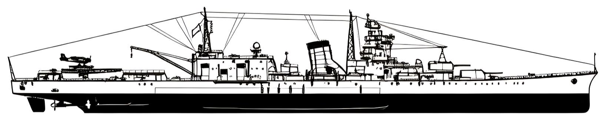

<p align="center">
  
</p>

<h1 align="center">⚓ kc_integrate</h1>

<p align="center">
  <b>舰C数据拦截与跨设备同步系统</b> — 在浏览器中被动采集《舰队Collection》游戏数据，推送至云端后端，实现跨设备状态监控与辅助决策。
</p>

---

## 📋 项目概览

| 维度 | 说明 |
|------|------|
| **定位** | 纯被动数据监听工具（零封号风险） |
| **采集端** | 浏览器用户脚本（Tampermonkey / Violentmonkey） |
| **后端** | Supabase Edge Functions + PostgreSQL |
| **展示端** | 独立前端页面（手机/PC/平板） |
| **核心能力** | API 拦截 → 数据解析 → 云端同步 → 跨设备查看 |

---

## 🏗️ 架构全景

```
┌─────────────────────────────────────────────────────────────┐
│                    平板端（Android / PC）                      │
│  ┌──────────────────────────────────────────────────────┐   │
│  │  浏览器（Edge / Chrome / X浏览器）                      │   │
│  │  ┌────────────────────────────────────────────────┐  │   │
│  │  │ 舰C游戏页面（DMM / KanColle）                   │  │   │
│  │  │ ┌────────────────────────────────────────────┐ │  │   │
│  │  │ │ 用户脚本（kc_grabber.user.js）              │ │  │   │
│  │  │ │ • 拦截 XMLHttpRequest / fetch 响应          │ │  │   │
│  │  │ │ • 解析 api_port / deck / ship2 等关键 API   │ │  │   │
│  │  │ │ • 页面内浮动面板（实时状态显示）              │ │  │   │
│  │  │ │ • 向后端推送结构化数据（JSON over HTTPS）     │ │  │   │
│  │  │ └────────────────────────────────────────────┘ │  │   │
│  │  └────────────────────────────────────────────────┘  │   │
│  └──────────────────────────────────────────────────────┘   │
└─────────────────────────────────────────────────────────────┘
                              │
                              ▼ HTTPS
┌─────────────────────────────────────────────────────────────┐
│                    云端后端（Supabase）                        │
│  ┌──────────────────────────────────────────────────────┐   │
│  │  Edge Functions（Serverless）                         │   │
│  │  • kc-ingest-deck    ← 接收舰队编成数据               │   │
│  │  • kc-ingest-ship2   ← 接收舰娘详情数据               │   │
│  │  • kc-ingest-battle  ← 接收战斗数据（规划中）         │   │
│  │  • kc-query-status   ← 供前端查询当前状态             │   │
│  └──────────────────────────────────────────────────────┘   │
│                              │                                │
│                              ▼                                │
│  ┌──────────────────────────────────────────────────────┐   │
│  │  PostgreSQL 数据库                                     │   │
│  │  • fleet_data      舰队快照表                          │   │
│  │  • ship_data       舰娘详情表                          │   │
│  │  • resource_log    资源变动日志（事件驱动）            │   │
│  │  • expedition_log  远征记录表                          │   │
│  │  • battle_log      战斗记录表（规划中）                │   │
│  └──────────────────────────────────────────────────────┘   │
└─────────────────────────────────────────────────────────────┘
                              │
                              ▼ HTTPS
┌─────────────────────────────────────────────────────────────┐
│                    展示端（任意设备浏览器）                    │
│  ┌──────────────────────────────────────────────────────┐   │
│  │  独立前端页面                                         │   │
│  │  • 舰队状态总览（编成、等级、装备）                    │   │
│  │  • 资源监控面板（油弹钢铝 + 恢复速率曲线）            │   │
│  │  • 远征/入渠倒计时（带推送提醒）                      │   │
│  │  • 战斗辅助（胜率预测、制空值计算）                    │   │
│  └──────────────────────────────────────────────────────┘   │
└─────────────────────────────────────────────────────────────┘
```

---

## 🚀 快速开始

### 1. 安装用户脚本

1. 浏览器安装 [Tampermonkey](https://www.tampermonkey.net/) 扩展
2. 点击 [kc_grabber.user.js](./kc_grabber.user.js) → "Raw" → Tampermonkey 自动识别安装
3. 编辑脚本顶部 `CONFIG` 区域，填入你的 Supabase URL 和 API Key

```javascript
const CONFIG = {
    SUPABASE_URL: 'https://your-project.supabase.co',
    API_KEY: 'your-api-key-here',
    ENABLE_PUSH: true
};
```

### 2. 进入游戏

打开 [DMM 舰队Collection](https://www.dmm.com/netgame/social/-/gadgets/=/app_id=854854/)，脚本自动激活。

右下角出现绿色浮动面板即表示拦截器已就绪：

```
🐵 舰C拦截测试 v1.3
状态: 工作中 ✅
后端: 已启用
#1 拦截成功
  API: deck
  预览: {"api_result":1,"api_data":[...]}
  ✅ deck 已同步
```

### 3. 查看数据

访问你的前端页面（部署中）或使用 Supabase Dashboard 直接查询数据库。

---

## 📁 仓库结构

```
kc_integrate/
├── 📄 README.md                    # 本文件
├── 📄 PRD.md                       # 产品需求文档 v1.0（原生App方案）
├── 📄 PRD2.0.md                    # 产品需求文档 v2.0（浏览器脚本方案）
├── 📄 full_stack.md                # 全栈实现指南（10步路线图）
├── 📄 api_pre.md                   # API 预处理清单（资源变动场景穷尽分析）
├── 📄 path.md                      # 实现路径分析（MVP → 完整生态）
├── 📄 path_phase1.md               # 阶段一详细步骤（环境搭建）
├── 📄 review.md                    # 舰C现有应用综述（竞品分析）
├── 📄 grab_restrict.md             # 数据拦截安全设计原则
├── 📄 local.md                     # 本地部署指南
├── 📄 construct_resource_account.md # 建造/资源会计系统设计
├── 📜 kc_grabber.user.js           # ⭐ 核心用户脚本（数据拦截器）
│
└── 📁 Functions/
    ├── 📄 Kancolle_API_Reference.md   # 舰C API 端点与返回数据对照表
    └── 📄 Resource_Account.md           # 资源会计系统设计（事件驱动记账）
```

---

## 🔒 安全声明

本项目严格遵循**三不原则**，确保零封号风险：

| 原则 | 说明 |
|------|------|
| **只读不写** | 仅读取 API 响应数据，绝不修改请求参数或响应内容 |
| **只发外部，不发游戏服务器** | 数据仅推送至自建后端，绝不向 DMM/舰C 服务器发送伪造请求 |
| **不模拟任何用户操作** | 仅在游戏自然产生的 API 请求触发时执行被动监听，不自动点击或提交 |

> 纯被动监听类工具（如 poi、KC3改、航海日志）在舰C社区有十年以上安全使用记录，风险极低。

---

## 📊 数据能力

### 已支持拦截的 API

| API 路径 | 数据内容 | 推送端点 |
|---------|---------|---------|
| `api_port/port` | 母港状态（资源、舰队、任务） | 规划中 |
| `api_get_member/deck` | 舰队编成 | `kc-ingest-deck` ✅ |
| `api_get_member/ship2` | 舰娘详情（等级、装备、状态） | `kc-ingest-ship2` ✅ |
| `api_req_sortie/battle` | 战斗数据 | 规划中 |
| `api_req_kousyou/createship` | 建造消耗 | 规划中 |
| `api_req_kousyou/createitem` | 开发消耗 | 规划中 |

### 资源会计系统

采用**事件驱动**设计，只记录资源变动事件而非状态快照：

```
❌ 传统方式: "14:32 燃料=125000"（每日20~50条噪音）
✅ 本系统:   "14:32 建造大和，燃料-1500，弹药-1500，钢材-2000，铝土-1000"
              （每日5~20条有效事件）
```

支持 8 项资源追踪：燃料、弹药、钢材、铝土、喷火器、桶、开发资材、螺丝。

---

## 🛠️ 技术栈

| 层级 | 技术 | 说明 |
|------|------|------|
| 采集端 | Vanilla JS + Tampermonkey API | 浏览器用户脚本 |
| 传输层 | HTTPS + JSON | 推送至 Supabase Edge Functions |
| 后端 | Supabase (PostgreSQL + Edge Functions) | Serverless，免运维 |
| 展示端 | 待定（React/Vue + Tailwind） | 独立前端页面 |
| 数据格式 | JSON (舰C API 原生格式) | 零转换损耗 |

---

## 📌 路线图

- [x] 基础 API 拦截（XHR + fetch）
- [x] 浮动面板实时显示
- [x] Supabase 后端接入（deck / ship2）
- [ ] 母港状态全量同步（api_port）
- [ ] 战斗数据拦截与解析
- [ ] 资源会计系统上线
- [ ] 远征/入渠倒计时与推送提醒
- [ ] 独立前端展示页面
- [ ] 制空值计算器集成
- [ ] 战斗胜率预测（后端AI）

---

## 🤝 相关项目

| 项目 | 类型 | 说明 |
|------|------|------|
| [poi](https://poi.io/) | 桌面端浏览器 | Electron + React，内置插件市场 |
| [KC3改](https://github.com/KC3Kai/KC3Kai) | Chrome 扩展 | 功能最丰富的浏览器插件 |
| [GotoBrowser](https://github.com/antest1/GotoBrowser) | Android 浏览器 | WebView + JS 注入 + Broadcast |
| [Kcanotify](https://github.com/antest1/kcanotify) | Android 辅助 | 接收 GotoBrowser 数据，悬浮窗面板 |
| [航海日志](https://github.com/Grabacr07/KanColleViewer) | 桌面端工具 | .NET 程序，数据嗅探 + 面板 |

---

## 📜 许可证

MIT License — 自由使用，风险自负。

> ⚠️ **免责声明**：本项目仅供学习研究之用。使用第三方工具参与在线游戏可能违反服务条款，请自行评估风险。作者不对任何账号问题负责。

---

<p align="center">
  <sub>Made with ⚓ by Qing-Feng | 提督很忙，数据帮你记</sub>
</p>
